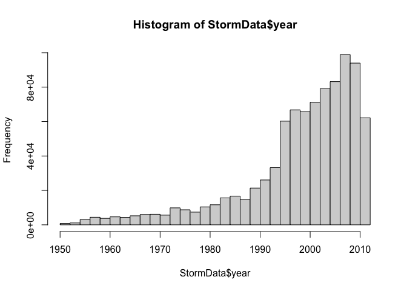
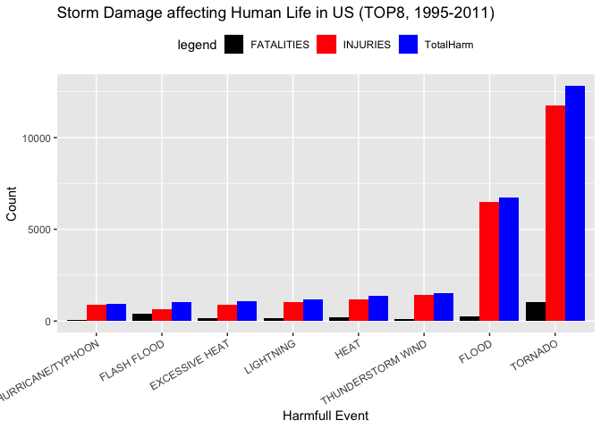
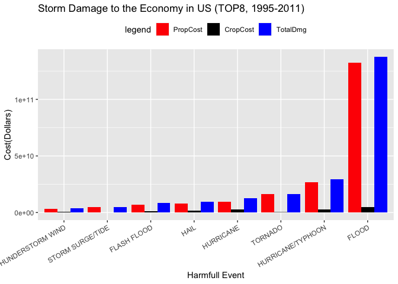

# Synopsis

In this report we aim to give an overview over storm related damages to
human life and the economy in the US over the time period from
1995-2011. We obtained a data set from the National Weather Service. We
decided not to include earlier years (available data starts in 1950),
since these data entries were considered incomplete due to fewer
recordings. After analysis, we concluded that Tornadoes are the most
harmful storm related event to human life, while floods cause the most
economic damage.

### Used packages

    library(data.table)
    library(dplyr)
    library(ggplot2)

# Data Processing

### Downloading and Reading in the Data

    destfile <- './data/stormdata.csv.bz2'
        if (!file.exists(destfile))
            {
            if(!file.exists("./data")){dir.create("./data")}
            fileurl <- "https://d396qusza40orc.cloudfront.net/repdata%2Fdata%2FStormData.csv.bz2"
            download.file(fileurl, destfile = "./data/stormdata.csv.bz2")
            }

    StormData <-  read.csv("./data/stormdata.csv.bz2")

**Getting an overview of the data**

     str(StormData)

    ## 'data.frame':    902297 obs. of  37 variables:
    ##  $ STATE__   : num  1 1 1 1 1 1 1 1 1 1 ...
    ##  $ BGN_DATE  : chr  "4/18/1950 0:00:00" "4/18/1950 0:00:00" "2/20/1951 0:00:00" "6/8/1951 0:00:00" ...
    ##  $ BGN_TIME  : chr  "0130" "0145" "1600" "0900" ...
    ##  $ TIME_ZONE : chr  "CST" "CST" "CST" "CST" ...
    ##  $ COUNTY    : num  97 3 57 89 43 77 9 123 125 57 ...
    ##  $ COUNTYNAME: chr  "MOBILE" "BALDWIN" "FAYETTE" "MADISON" ...
    ##  $ STATE     : chr  "AL" "AL" "AL" "AL" ...
    ##  $ EVTYPE    : chr  "TORNADO" "TORNADO" "TORNADO" "TORNADO" ...
    ##  $ BGN_RANGE : num  0 0 0 0 0 0 0 0 0 0 ...
    ##  $ BGN_AZI   : chr  "" "" "" "" ...
    ##  $ BGN_LOCATI: chr  "" "" "" "" ...
    ##  $ END_DATE  : chr  "" "" "" "" ...
    ##  $ END_TIME  : chr  "" "" "" "" ...
    ##  $ COUNTY_END: num  0 0 0 0 0 0 0 0 0 0 ...
    ##  $ COUNTYENDN: logi  NA NA NA NA NA NA ...
    ##  $ END_RANGE : num  0 0 0 0 0 0 0 0 0 0 ...
    ##  $ END_AZI   : chr  "" "" "" "" ...
    ##  $ END_LOCATI: chr  "" "" "" "" ...
    ##  $ LENGTH    : num  14 2 0.1 0 0 1.5 1.5 0 3.3 2.3 ...
    ##  $ WIDTH     : num  100 150 123 100 150 177 33 33 100 100 ...
    ##  $ F         : int  3 2 2 2 2 2 2 1 3 3 ...
    ##  $ MAG       : num  0 0 0 0 0 0 0 0 0 0 ...
    ##  $ FATALITIES: num  0 0 0 0 0 0 0 0 1 0 ...
    ##  $ INJURIES  : num  15 0 2 2 2 6 1 0 14 0 ...
    ##  $ PROPDMG   : num  25 2.5 25 2.5 2.5 2.5 2.5 2.5 25 25 ...
    ##  $ PROPDMGEXP: chr  "K" "K" "K" "K" ...
    ##  $ CROPDMG   : num  0 0 0 0 0 0 0 0 0 0 ...
    ##  $ CROPDMGEXP: chr  "" "" "" "" ...
    ##  $ WFO       : chr  "" "" "" "" ...
    ##  $ STATEOFFIC: chr  "" "" "" "" ...
    ##  $ ZONENAMES : chr  "" "" "" "" ...
    ##  $ LATITUDE  : num  3040 3042 3340 3458 3412 ...
    ##  $ LONGITUDE : num  8812 8755 8742 8626 8642 ...
    ##  $ LATITUDE_E: num  3051 0 0 0 0 ...
    ##  $ LONGITUDE_: num  8806 0 0 0 0 ...
    ##  $ REMARKS   : chr  "" "" "" "" ...
    ##  $ REFNUM    : num  1 2 3 4 5 6 7 8 9 10 ...

**We need to address the following issues:**

1.  According to the instructions, earlier years may not hold highly
    representative data. Let’s check the data volume first.
2.  We only need some of the columns to answer our questions.

### Data Quality

**Checking the data quality of earlier years**

    StormData$year <- as.numeric(format(as.Date(StormData$BGN_DATE, format = "%m/%d/%Y %H:%M:%S"), "%Y"))

    hist(StormData$year, breaks = 30)

Data volume seems to pick up in the mid 90s. Let’s only use data
starting from 1995.

            Storm95 <- subset(StormData, year >= 1995)

### Simplifying Data

**Sub-setting our data set to only include necessary columns**

We’re interested in:

-   damages to human life(“FATALITIES” & “INJURIES”)
-   economic damages (“PROPDMG”, “PROPDMGEXP”, “CROPDMG”, “CROPDMGEXP”)
-   sorted by type of event (“EVTYPE”)

<!-- -->

    StormCol <- Storm95[, c('EVTYPE',
                            'FATALITIES',
                            'INJURIES',
                            'PROPDMG',
                            'PROPDMGEXP',
                            'CROPDMG', 
                            'CROPDMGEXP')]

We can also exclude all rows that only contain the value “0” to simplify
our data set.

    StormClean <- subset(StormCol, INJURIES > 0 | FATALITIES > 0 | PROPDMG > 0 | CROPDMG > 0)

Let’s have a look at our data set so far.

    str(StormClean)

    ## 'data.frame':    211775 obs. of  7 variables:
    ##  $ EVTYPE    : chr  "HURRICANE OPAL/HIGH WINDS" "HURRICANE ERIN" "THUNDERSTORM WINDS" "HURRICANE OPAL" ...
    ##  $ FATALITIES: num  2 0 0 0 0 0 0 0 0 0 ...
    ##  $ INJURIES  : num  0 0 0 0 0 0 0 0 0 0 ...
    ##  $ PROPDMG   : num  0.1 25 50 48 20 2 35 5 3 5 ...
    ##  $ PROPDMGEXP: chr  "B" "M" "K" "M" ...
    ##  $ CROPDMG   : num  10 1 0 4 10 0 0 0 0 0 ...
    ##  $ CROPDMGEXP: chr  "M" "M" "" "M" ...

**Exponents**  
Another issue becomes clear: The two columns containing the exponents
for the economic costs (“PROPDMGEXP”, “CROPDMGEXP”) don’t contain
numeric values. This needs to be changed for further calculations.

    ### List all Exponents used in PROPDMGEXP
    unique(StormClean$PROPDMGEXP)

    ##  [1] "B" "M" "K" "m" ""  "+" "5" "0" "6" "4" "2" "7" "3" "H" "-"

**Deal with PropExp**

    ### Create a data frame containing a value code that we can then use to merge our data.
    PropOldEx <- c("B", "M", "K", "\"\"", "+", "5", "0", "6", "4", "2", "7", "3", "H", "-")
    PropNewEx <- c(10^9, 10^6, 10^3, 10^0, 10^0, 10^5, 10^0, 10^6, 10^4, 10^2, 10^7, 10^3, 10^2, 10^0)

    MergePropTable <- data.frame(PropNewEx, PropOldEx)
    MergePropTable

    ##    PropNewEx PropOldEx
    ## 1      1e+09         B
    ## 2      1e+06         M
    ## 3      1e+03         K
    ## 4      1e+00        ""
    ## 5      1e+00         +
    ## 6      1e+05         5
    ## 7      1e+00         0
    ## 8      1e+06         6
    ## 9      1e+04         4
    ## 10     1e+02         2
    ## 11     1e+07         7
    ## 12     1e+03         3
    ## 13     1e+02         H
    ## 14     1e+00         -

    ### Merge the old df with the created MergePropTable to create a new df that contains the new exponents.
    StormPropExp <- merge(StormClean, MergePropTable, 
                          by.x = "PROPDMGEXP", by.y = "PropOldEx")

    ### Delete the old PROPDMGEXP-column
    StormPropExp <- subset(StormPropExp, select = -PROPDMGEXP) 

**Deal with CropExp**

    ### List all Exponents used in CROPDMGEXP
    unique(StormClean$CROPDMGEXP)

    ## [1] "M" ""  "m" "K" "B" "?" "k" "0"

This employs exactly the same strategy as for the Property columns.

    CropOldEx <- c("M", "\"\"", "K", "B", "?", "k", "0")
    CropNewEx <- c(10^6, 10^0, 10^3, 10^9, 10^0, 10^0, 10^0)

    MergeCropTable <- data.frame(CropNewEx, CropOldEx)

    StormCropEx <- merge(StormPropExp, MergeCropTable, 
                         by.x = "CROPDMGEXP", by.y = "CropOldEx")
    StormCropEx <- subset(StormCropEx, select = -CROPDMGEXP) 

To finish Data Processing, we rearrange the columns, so that the
corresponding cost-column and exponent-column are side by side.

    StormAnalysis <- StormCropEx[, c(1,2,3,4,6,5,7)]
    head(StormAnalysis)

    ##               EVTYPE FATALITIES INJURIES PROPDMG PropNewEx CROPDMG CropNewEx
    ## 1  FLOOD/FLASH FLOOD          0        0     0.5     1e+06       0         1
    ## 2 THUNDERSTORM WINDS          0        0    80.0     1e+03       0         1
    ## 3  FLOOD/FLASH FLOOD          0        0   400.0     1e+03       0         1
    ## 4            TORNADO          0        0    40.0     1e+03      50         1
    ## 5 THUNDERSTORM WINDS          0        0     1.0     1e+03       0         1
    ## 6            TORNADO          0        0   100.0     1e+03      50         1

# Results

After processing the data, we can finally start to address the
questions:

### Question 1: Across the United States, which types of events are most harmful with respect to population health?

We aggregated both the fatality and the injury values by event type. We
then added the respective values to create a new “TotalHarm” column,
which we used to order the events.

    ### Aggregate by event type
    StormHarm <- aggregate(cbind(FATALITIES, INJURIES) ~ EVTYPE , StormAnalysis, sum)

    ### Add injuries and fatalities to new TotalHarm column
    StormHarm <- StormHarm %>%
            mutate(TotalHarm = FATALITIES + INJURIES)

    ### Sort events by most harmful.
    StormHarm <- arrange(StormHarm, -TotalHarm)

Since there are still a lot of event types and we want to know which are
the most harmful, we took only the TOP 8 rows.

    StormPlot <- StormHarm[(1:8), ]
    head(StormPlot)

    ##              EVTYPE FATALITIES INJURIES TotalHarm
    ## 1           TORNADO       1040    11763     12803
    ## 2             FLOOD        231     6487      6718
    ## 3 THUNDERSTORM WIND        130     1406      1536
    ## 4              HEAT        204     1172      1376
    ## 5         LIGHTNING        173     1009      1182
    ## 6    EXCESSIVE HEAT        171      899      1070

We are then ready to plot our graph.

    ### Melt the columns by event type.
    StormPlot <- melt(StormPlot, id.vars="EVTYPE", variable.name = "Harm")

    ### Using geom_bar to plot the data.
    ggplot(StormPlot, aes( x = reorder(EVTYPE, value), value)) +
            geom_bar(stat="identity", aes(fill=Harm), position="dodge") +
            ggtitle ("Storm Damage affecting Human Life in US (TOP8, 1995-2011)") +
            ylab("Count") +
            xlab ("Harmfull Event") + 
            theme(legend.position = "top" ,axis.text.x = element_text(angle=30, hjust=1)) + 
            scale_fill_manual("legend", 
                              values = c("FATALITIES" = "black", "INJURIES" = "red", "TotalHarm" = "blue"))

### Result Question 1

It is evident that Tornadoes cause by far the most Harm to Human life in
the time frame across the US. Both their death count and injury count
are higher compared to the other categories. Floods cause the second
most harm. The third most harmful event, Thunderstorm Winds, causes
significantly less harm than the first two events. It also stands out
that Flash Floods have a relatively high death count, compared to other
categories, albeit lower than Tornadoes.

### Question 2 :Across the United States, which types of events have the greatest economic consequences?

To answer this question, we first need to multiply the cost columns with
their respective exponent columns.

    StormEcon <- StormAnalysis %>%
            mutate(PropCost = PROPDMG * PropNewEx,
                   CropCost = CROPDMG * CropNewEx
            )

We then, again, aggregated Property Costs and Crop Costs by event type,
created a TotalDamage column using their sums, and ordered the columns.

    ### Aggregate by event type

    StormEconAg <- aggregate(cbind(PropCost, CropCost) ~ EVTYPE , StormEcon, sum)        
    ### Add Crop and Prop Costs to new TotalDmg column.

    StormEcoDmg <- StormEconAg %>%
            mutate(TotalDmg = PropCost + CropCost)

    ### Sort events by most damaging.
    StormEcoDmg <- arrange(StormEcoDmg, -TotalDmg)

    ### Only include the Top 8.
    StormPlot2 <- StormEcoDmg[(1:8), ]

    head(StormPlot2)

    ##              EVTYPE     PropCost   CropCost     TotalDmg
    ## 1             FLOOD 132506517500 4932518400 137439035900
    ## 2 HURRICANE/TYPHOON  26740295000 2607872800  29348167800
    ## 3           TORNADO  16062510340  285620220  16348130560
    ## 4         HURRICANE   9715858000 2688410000  12404268000
    ## 5              HAIL   7698071790 1849423650   9547495440
    ## 6       FLASH FLOOD   7135470077 1315750000   8451220077

We then plotted the data.

    ### Melt the columns by event type.

    StormPlot2 <- melt(StormPlot2, id.vars="EVTYPE", variable.name = "Damage")

    ### Plot using geom_bar.
    ggplot(StormPlot2, aes( x = reorder(EVTYPE, value), value)) +
            geom_bar(stat="identity", aes(fill=Damage), position="dodge") +
            ggtitle ("Storm Damage to the Economy in US (TOP8, 1995-2011)") +
            ylab("Cost(Dollars)") +
            xlab ("Harmfull Event") + 
            theme(legend.position = "top" ,axis.text.x = element_text(angle=30, hjust=1)) + 
            scale_fill_manual("legend", 
                              values = c("CropCost" = "black", "PropCost" = "red", "TotalDmg" = "blue")) 

### Results Question 2

The most harmful storm event concerning the economic parameters in the
time frame across the US are clearly floods. Their damage to property is
clearly causing the most damage over all. Floods are also responsible
for the most Crop Costs compared to the other Top 7 events, but this
number is much lower than the damage to property. A noticeable trend is,
that in all categories, Property Costs are a lot higher than Crop Cost.
